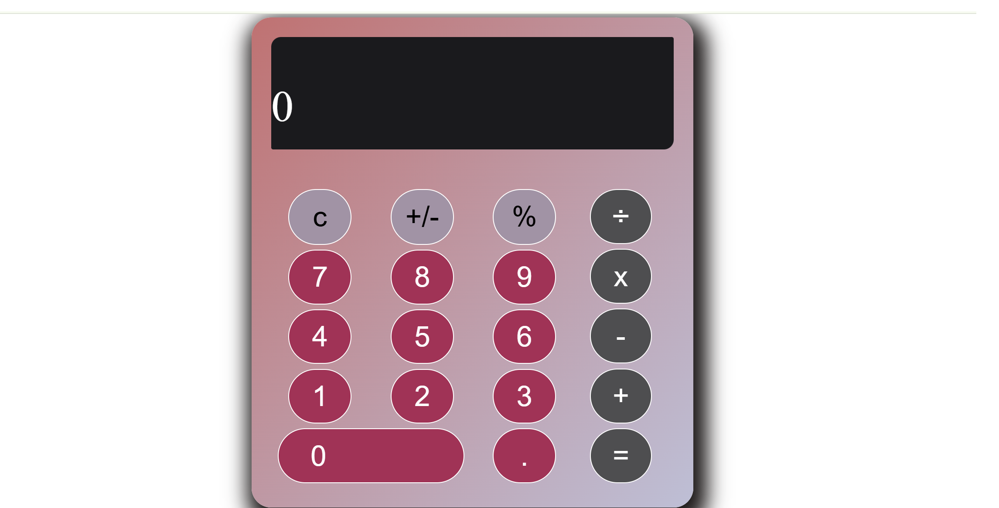

# Simple Calculator built with HTML,CSS,JavaScript and JQuery
This is a simple calculator application built within 24 hours to practice and showcase basic web development skills. The project uses HTML, CSS, and JavaScript with jQuery for interactive functionality. It allows users to perform basic arithmetic operations like addition, subtraction, multiplication, and division in an intuitive and responsive layout.

# Features
**Interactive UI:** Smooth user interaction with clear button clicks and visual feedback.
**Real-time Calculation:** Displays results instantly as you input numbers and operations.
**User-friendly Interface:** Simple and intuitive layout for easy use by anyone.
**Basic Arithmetic Operations:** Perform addition, subtraction, multiplication, and division.

# Screenshot
Here’s how the calculator looks:

# Lessons Learned
**Improved JavaScript Skills:** Gained a deeper understanding of handling basic JavaScript logic for operations and user input.
**Working with jQuery:** Learned how to use jQuery for DOM manipulation and event handling, making the app more interactive and dynamic.
**Responsive Design:** Gained hands-on experience in creating a responsive layout to ensure the calculator works well on both mobile and desktop.
**Debugging and Problem-Solving:** Strengthened my debugging skills by resolving issues with calculations and layout on different screen sizes.
**UI/UX Basics:** Learned the importance of simple, intuitive design and user experience, making sure the app is easy to use for everyone.
